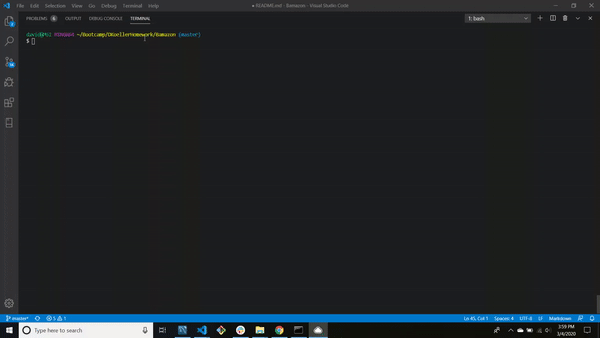
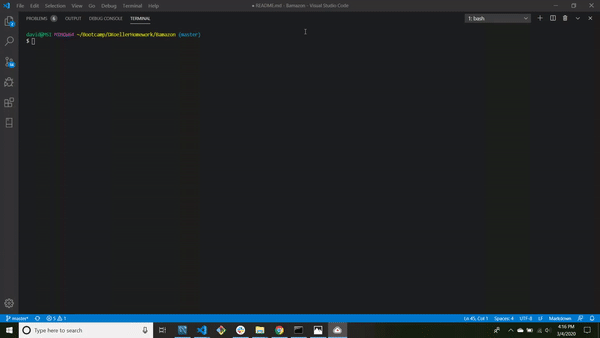

# Bamazon
This is Bamazon, an Amazon-like storefront using MySQL and Node.js.  The app will take in orders from customers and deplete stock from the store's inventory.  

There are two ways to acces Bamazon.  Either as a Customer or a Manager.  

If you run bamazonCustomer.js you'll shown all of the available product that you can purchase.  You'll then be allowed to purchase product using the product ID.  The application will then calculate the total cost of your purchase.  

If you run bamazonManager.js you'll be shown all the options that you be able to do: 
1. View Products - You'll see all products for sale, price, and quantitiy.

2. View Low Inventory - You'll be able to see all product that has a quantity less than 5.

3. Add Inventory - You'll be able to update the quantity of any product you have added.

4. Add Product - You'll be able to add a new product to the store inventory.  

5. Log Out - Log off of the application.

--------

Use bamazon.sql to create the database and the table in order to use BAMAZON.  

Use bamazon_seeds.sql to fill in your initial product.  Feel free to customize your product to fit your needs.

DO NOT change any of the names of the database or columns within the table or the application will not work properly.

Please change the 'password:' section of the 'var connection' in both bamazonCustomer.js and bamazonManager.js to your password.  You may also have to update the 'host', 'port', and 'user' information in order for the app to work properly.

---------

In order to use the BAMAZON app you'll NEED to have this software installed:

1. Node.js: https://nodejs.org/en/

2. SQL Database: RECOMMENDED - MySQL: https://www.mysql.com/

You will also need these node packages installed:

1. mysql: version: "2.18.1"

2. inquirer: version: "7.0.5" 

3. (ONLY IF YOU WANT TO USE A .ENV TO HIDE YOUR PASSWORD!) dotenv: version: "8.2.0"

---------

bamazonCustomer.js:

bamazonManager.js:

